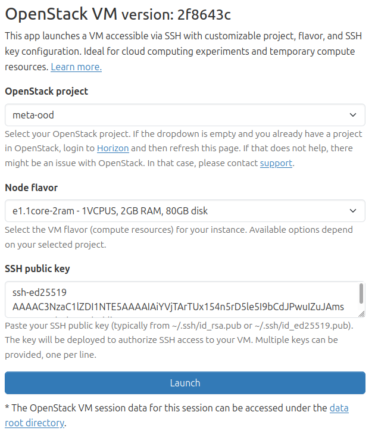
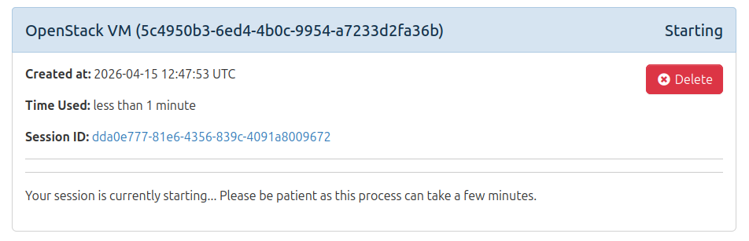
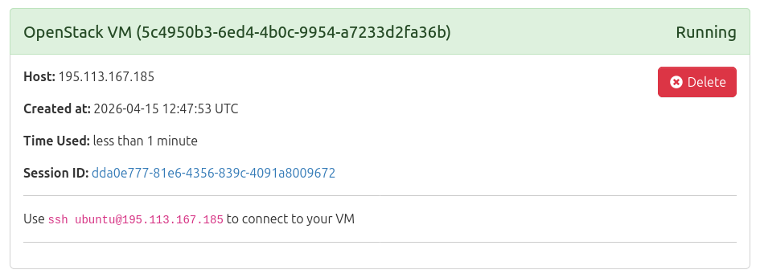

# OpenStack VM

Deploy an interactive Ubuntu virtual machine on OpenStack cloud infrastructure via Open OnDemand.

## Overview

This Open OnDemand Batch Connect app launches Ubuntu VMs on OpenStack cloud infrastructure. Users can select their project, choose a node flavor, and provide an SSH public key for secure access to the deployed VM.

## How it looks

### Launch form

| Project and flavor  selection, public key definition | 
|------------------------------------------------------|
|                           |
### Progress after job submission

| |
|---|
|  | 

| |
|---|
 |

## Supporting Materials

### Conference Materials
- <a href="https://pretalx.com/good-2026/talk/ATV33X/" target="_blank" rel="noopener noreferrer">GOOD26 Conference Talk Abstract</a>
- <a href="https://vimeo.com/showcase/12164326?video=1174783975" target="_blank" rel="noopener noreferrer">GOOD26 Conference Talk</a>

## Features

- **Dynamic Project Selection**: Automatically loads available OpenStack projects from the configured cloud instance
- **Flavor-Based Sizing**: Choose from available VM flavors with project-specific options
- **SSH Key Authentication**: Secure access via SSH public key deployment
- **Error Logging**: Displays error logs in the session view for troubleshooting

## Requirements

### Server-Side Requirements

- Open OnDemand 4.2+
- **Coder Cluster**: This app uses with the Coder resource manager for VM lifecycle management. See the [Coder documentation](https://osc.github.io/ood-documentation/latest/installation/resource-manager/coder.html) for setup and configuration details.

### Compute Node Requirements

- No special requirements - VMs are deployed directly to OpenStack

### User Requirements

- SSH key pair for VM access

## Installation

1. Copy this repository to your Open OnDemand apps directory:

```bash
cd /etc/ood/config/apps
git clone <repository-url> bc_openstack_vm
```

## 2. Configure for your site

Edit `form.ymle.rb` and update these values for your cluster:

| Attribute | Default | Change to |
|-----------|---------|-----------|
| `openstack_instance` | `"brno.openstack.cloud.e-infra.cz"` | Your OpenStack instance |
| `token_file` | `"/tmp/#{user}-os-token.json"` | Path for OAuth token |
| `cluster_name` | `"coder"` | Default partition/queue |
| `coder_template_version_id` | `"NaN"` | Coder workspace template version ID |
| `coder_org_id` | `"NaN"` | Coder organization ID |

### 3. Verify

No OOD restart is needed (Batch Connect apps are detected automatically). Visit your OOD dashboard and look for **[App Name]** under **Interactive Apps > [Category]**.


## Configuration

### form.yml.erb attributes

The form defines both static and dynamic attributes that are populated at runtime:

#### Dynamic Attributes

| Attribute | Widget | Source | Description |
|-----------|--------|--------|-------------|
| `project_id` | `select` | OpenStack API | Populated from available OpenStack projects. Users select the project where their VM will be deployed. Options are loaded dynamically via `OodCore::OpenStackHelper#load_projects_and_flavors`. |
| `flavor` | `select` | OpenStack API | Populated from available VM flavors. Each flavor is tied to specific projects using exclusive options (via `data-exclusive-option-for-project-id-*` attributes). Flavor availability depends on the selected project. |
| `ssh_public_key` | `text_area` | User input | Required field where users paste their SSH public key(s). Multiple keys can be provided, one per line. The key is deployed to the VM for SSH access. |

#### Static Attributes

| Attribute | Value | Description |
|-----------|-------|-------------|
| `template_version_id` | Configured in [`form.yml.erb`](form.yml.erb#L9) | Coder workspace template version ID used for VM provisioning. |
| `org_id` | Configured in [`form.yml.erb`](form.yml.erb#L10) | Coder organization ID for workspace organization. |

### Customizing the OpenStack Instance

To use a different OpenStack cloud, modify line 5 in [`form.yml.erb`](form.yml.erb):

```ruby
openstack_instance = "your.openstack.instance.cz"
```

### Adding Custom Flavors

Flavors are automatically discovered from the OpenStack API. To filter or modify available flavors, edit the `flavors` processing in [`form.yml.erb`](form.yml.erb).

## Usage

1. Navigate to the app in your Open OnDemand dashboard
2. Select your OpenStack project from the dropdown
3. Choose the desired VM flavor
4. Paste your SSH public key
5. Click "Launch" to deploy the VM
6. Use the provided SSH command to connect to your VM

## Troubleshooting

### Common Issues

#### Empty Project Dropdown
- Verify your OpenStack credentials are valid
- Check network connectivity from the OOD host to the OpenStack API

#### VM Deployment Fails
- Confirm the selected flavor is available in your project
- Check that your project has sufficient quota
- Review OpenStack service status (Nova, Neutron)

#### Token File Errors
- Ensure the token file path is writable
- Tokens are generated using the pun hook
- Check disk space in `/tmp` directory
- Clear stale tokens: `rm /tmp/<username>-os-token.json`

### Viewing Error Logs

Click the "Show error logs" button in the session view to diagnose issues. Error logs include:
- API connection failures
- Authentication errors
- Resource provisioning failures

## Known Limitations
?

## Testing

This app has been tested with:
- Open OnDemand 4.2

## Support

For issues specific to this app, open an issue in the repository. For Open OnDemand platform issues, visit the [Open OnDemand Discourse](https://discourse.openondemand.org/).

## License

This project is licensed under the MIT License - see the [LICENSE](LICENSE) file for details.
